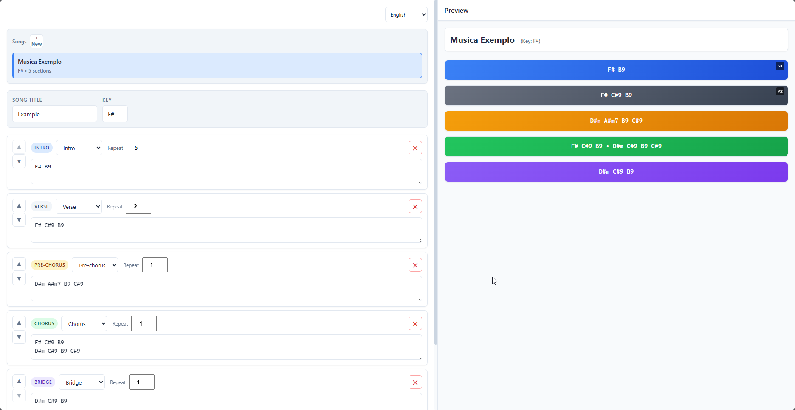
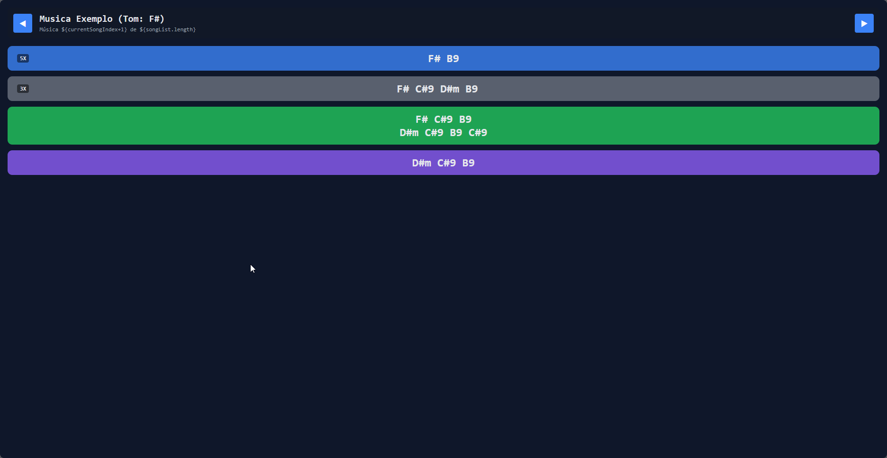
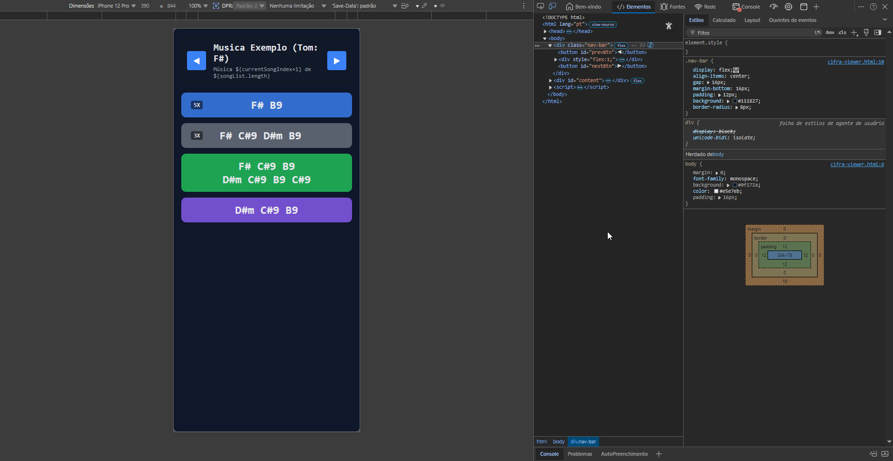

# Configurador de Cifras - Teleprompter para Músicos

Um aplicativo web moderno e intuitivo para criar setlists de apresentações com cifras. Funciona como um teleprompter barato e simples, permitindo que músicos tenham acesso às cifras e estrutura das canções de forma organizada durante apresentações.

## Características

- **Gerenciador de Canções**: Crie múltiplas canções com diferentes tonalidades para sua setlist
- **Estrutura Flexível**: Organize suas canções em seções (Intro, Verso, Pré-refrão, Refrão, Ponte)
- **Repetições**: Configure quantas vezes cada seção deve ser repetida
- **Preview em Tempo Real**: Visualize a estrutura conforme você edita
- **Responsivo**: Funciona perfeitamente em desktop, tablet e celular (use seu smartphone como teleprompter)
- **Multilíngue**: Suporte para Português, Inglês e Espanhol
- **Salva Automaticamente**: Seus dados são guardados no navegador
- **Exportar como HTML**: Gere um visualizador portátil para usar em qualquer dispositivo durante suas apresentações

## Capturas de Tela

### Configuração no Desktop


### Visualização do Resultado - Desktop


### Visualização do Resultado - Mobile


## Como Usar

### Começar uma Nova Canção

1. Clique no botão "+ Nova" para criar uma nova canção
2. Preencha o título da canção
3. Defina a tonalidade (Tom)

### Adicionar Seções

1. Use o menu suspenso para selecionar o tipo de seção:
   - Intro - Introdução instrumental
   - Verso - Verso da música
   - Pré-refrão - Ponte para o refrão
   - Refrão - Refrão principal
   - Ponte - Seção especial

2. Insira as cifras/acordes em cada seção (um por linha)
3. Configure o número de repetições
4. Use os botões para reorganizar as seções

### Visualizar e Exportar

- Preview: Veja a estrutura completa em tempo real no painel direito
- Exportar: Clique em "Exportar" para gerar um arquivo HTML visualizável em qualquer navegador durante sua apresentação

### Alterar Idioma

Use o seletor de idioma no canto superior direito para mudar entre:
- Português
- English
- Español

## Tecnologias

- HTML5: Estrutura semântica
- CSS3: Estilo responsivo com variáveis CSS
- JavaScript Vanilla: Sem dependências de framework
- i18next: Internacionalização
- LocalStorage API: Persistência de dados

## 📦 Estrutura do Projeto

```
chord-sheet-creator/
├── cifra_song_configurator.html    # Interface principal
├── cifra_song_configurator.js      # Lógica da aplicação
├── cifra_song_configurator.css     # Estilos
├── i18n-config.js                  # Configuração de idiomas
├── locales.json                    # Traduções (PT, EN, ES)
├── assets/                         # Imagens e recursos
│   ├── config-desktop.png
│   ├── result-destop.png
│   └── result-mobile.png
└── README.md                       # Este arquivo
```

## Implantação em GitHub Pages

Este projeto está pronto para GitHub Pages. Para implantar:

1. Faça push para GitHub:
   ```bash
   git add .
   git commit -m "Adicionar README e preparar para GitHub Pages"
   git push origin main
   ```

2. Ative GitHub Pages:
   - Vá para Settings do repositório
   - Selecione "Pages" no menu lateral
   - Escolha "main" como branch de origem
   - Salve as configurações

3. Acesse seu site:
   - https://seu-usuario.github.io/chord-sheet-creator

## Armazenamento de Dados

Todos os seus dados (canções, seções, cifras) são salvos automaticamente no localStorage do navegador. Isso significa:

- Seus dados persistem entre sessões
- Os dados são específicos do navegador/dispositivo
- Nenhum servidor externo necessário

## Para Desenvolvedores

### Adicionar um novo idioma

1. Abra locales.json
2. Adicione suas traduções na estrutura JSON
3. Atualize o seletor de idioma no HTML

### Estrutura de Chaves de Tradução

```javascript
{
  "app": {
    "title": "Configurador de Cifras",
    "description": "Crie e exporte configurações de canções"
  },
  "songs": {
    "label": "Canções",
    "title": "Título da canção",
    "key": "Tom"
  },
  "sections": {
    "types": {
      "intro": "Intro",
      "verse": "Verso",
      "pre": "Pré-refrão",
      "chorus": "Refrão",
      "bridge": "Ponte"
    }
  }
}
```

## Compatibilidade

- Chrome/Chromium (recomendado)
- Firefox
- Safari
- Edge
- Navegadores móveis modernos

## Licença

Este projeto é de código aberto. Sinta-se livre para usar, modificar e distribuir.

## Contribuições

Contribuições são bem-vindas. Sinta-se à vontade para:
- Reportar bugs
- Sugerir novas funcionalidades
- Melhorar a documentação
- Adicionar novos idiomas

## Suporte

Se encontrar problemas ou tiver dúvidas, abra uma issue no repositório do GitHub.

---

Feito para músicos e apresentadores que precisam de uma solução simples e acessível.
